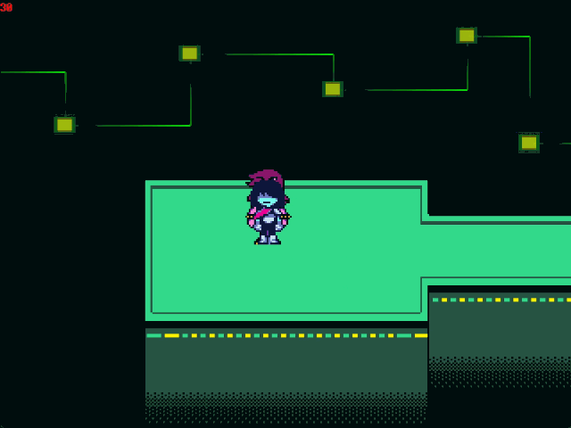
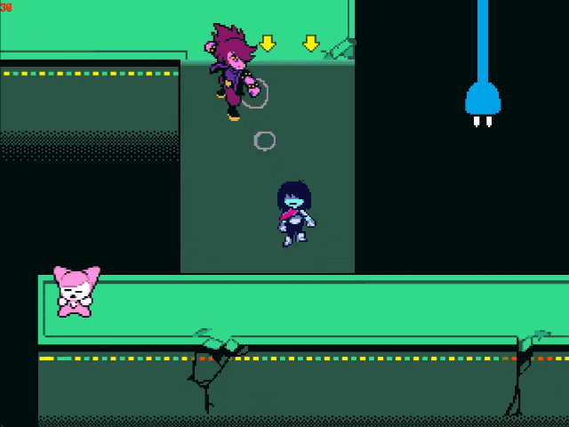

# SnowGrave(Glitched)

## 注意事項
本カテゴリーではPC版(v1.15)とSwitch/PS4版(v1.10)で一部ルートが異なる。

##　ルート

### サイバーフィールド

ゲームを開始したら、CtrlキーとShiftキーを押す。

カットシーンが終わり、クリスを操作できるようになったら、右に進みベッドを調べる。選択肢は「ねむる」(右側)

闇の世界に入ったら、右へと進む。この時、wrong warpを行うことで最大1秒短縮することができる。 
 

次の部屋でもwrong warpで最大1秒短縮できる。 

右に進むとカットシーンの後ケーブロイド2体と戦闘になる。

#### 普通の攻略法
ひたすら攻撃を行う。バーの精度が良ければ3ターンで終了することが可能。

#### TadyWire
片方を逃がし、もう片方を倒す方法。こちらも3ターンで終了するが、上記の方法より攻撃回数が3回少ない分少し速い。

|ターン/キャラクター|クリス|スージィ|
| --- | --- | --- | 
|1|ユラユラ(右の選択肢)|攻撃(下の個体に)|
|2|ユラユラ|にがす(上の個体に)|
|3|攻撃|攻撃|

#### ThrowWire
2体とも逃がす最速の方法。同じく3ターンかかるが、攻撃を一切しないためTadyWireよりさらに速い。 
ただし、ケーブル投げで2体どちらにも当てるには運も絡むため安定を取るならTadyWireの方がおすすめ。

|ターン/キャラクター|クリス|スージィ|
| --- | --- | --- | 
|1|ケーブル投げ|-|
|2|ユラユラ(右の選択肢)|にがす|
|3|ユラユラ|にがす|

!>このカテゴリーでは必要ゴールドに対して取得できるゴールドがかなりギリギリなのでこれ以降の戦闘で大量にTPを稼げる自信がない場合、普通の攻略法で倒すことを推奨する。

ケーブロイド戦が終わったら右に進みスライダーを下りる。

ボクシングのイベントが発生する部屋まで道なりに進むが、道中にいるケーブロイドとタスクと戦闘を行う。コマンドは以下の通り。

ケーブロイド

|ターン/キャラクター|クリス|スージィ|ラルセイ|
| --- | --- | --- | --- |
|1|防御|防御|スリープ|
|2|防御|防御|スリープ|

タスク

|ターン/キャラクター|クリス|スージィ|ラルセイ|
| --- | --- | --- | --- |
|1|やさしい声(右下の選択肢)|防御|-|
|2|にがす|にがす|防御|

### ボクシング
ゲーム筐体が置かれた後動けるようになったら、その場で上を向いて調べる。左に移動する必要はない。

ボクシングではクイーンが攻撃するまでに2度パンチを入れることができる。また、相手の攻撃を避けるタイミングを計るために多くの人は、 
2回パンチ→1回空振り→回避 
というパターンで動く。ただし相手の攻撃がキックの場合、最速で上の行動をすると被弾するので、空振りの後回避を少し間をおいて行うようにする。

車輪を左右から飛ばしてくる攻撃では、タイミングよく攻撃を行うことで少しだけ時間を節約できる。

残りタイム73で終了できると最速。

ボクシング後の選択肢ではどちらを選んでもよい。(かかる時間が同じ)

動けるようになったらセーブポイントでセーブを行い、メニューから一度タイトルに戻りセーブをロードする。

### Door Warp

ロードしたらwrong warp(以降ww)を右方向に2回行う。

ノーツが落ちてくる部屋ではノーツに6回被弾する。被弾したら右→下の順でwwを行う。

wwに失敗した場合、メニューからタイトルに戻りこのセクションの最初からやり直す。

wwが終わったら上に進みDJ戦を行う。

ダンスX(下の選択肢)を選んで被弾し、わざとゲームオーバーになる。タマシイが割れる演出中決定キーを連打すると速く再開することができる。

コンティニューしたら右→下とwwを行う。

2度目のDJ戦ではクリスはぶんせき(デフォルトの選択肢)を選び他2人は防御を選択する。 
相手のターンではクリスがダウンするまで被弾する。初めのターンで出来なかった場合、ターゲットがランダムになってしまうので必ず最初のターンで終わらせること。

コンティニューしたら右方向に2回行う。

ノーツに2回被弾して右→下の順でwwを行う。(各wwはさっきと同じなので省略)

DJ戦ではダンスX(下の選択肢)を選ぶ。 
敵のターンではクリスがダウンするまで被弾する。ターゲットはランダムなので先にクリス以外がダウンすることもある。その場合はゲームオーバーになってもう一度行う。

クリスがダウンしたらSアクション、Rアクションのチュートリアルになる。
