# アイテムの場所(No StarWorld)

## マント
|コース|場所|画像|
| ---- | ---- | ---- |
|ドーナツへいや　コース1|マントガメ(マントが赤く点滅している個体のみ)|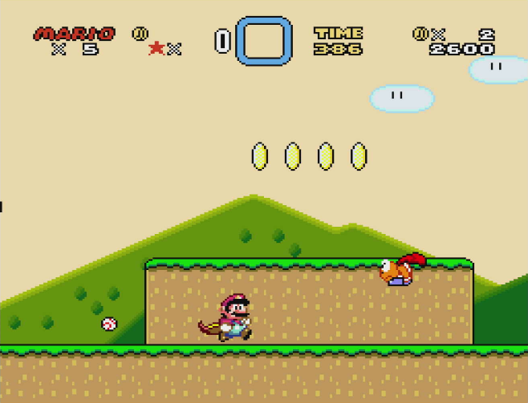 |
|ドーナツへいや　コース3|中間ゲート後、回転する灰リフトの?ブロック| |
|ドーナツへいや　コース4|ルーレットブロック| |
|ドーナツへいやのしろ|3部屋目道中の?ブロック|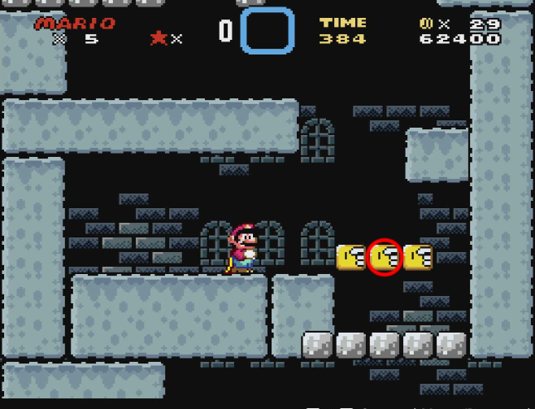 |
|バニラドーム　ひみつのコース1|スタート地点左側の?ブロック|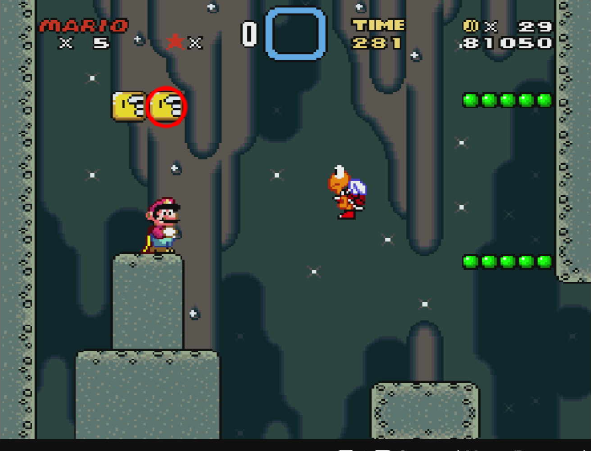 |
||バネ付近の?ブロック|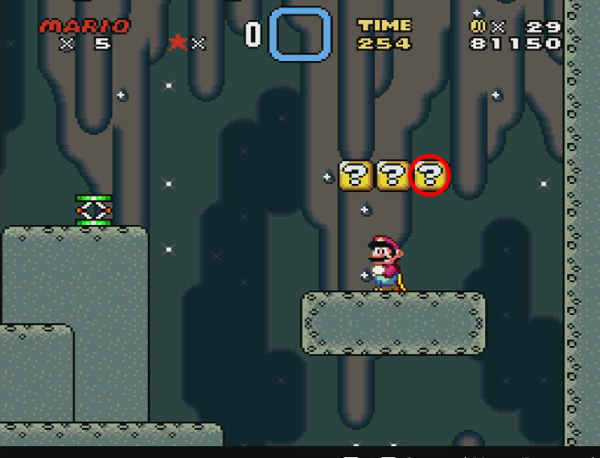 |
|バニラだいち　ひみつのコース2|中間ゲート後、音符ブロック|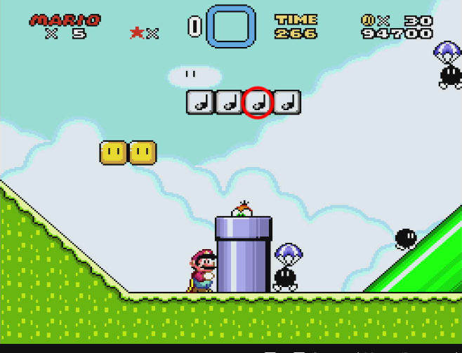 |
|バニラだいち　ひみつのコース3|スタート直後の?ブロック|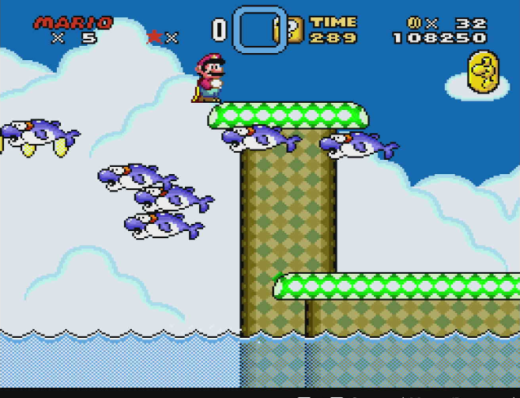 |
|バニラだいちのとりで|道中の?ブロック|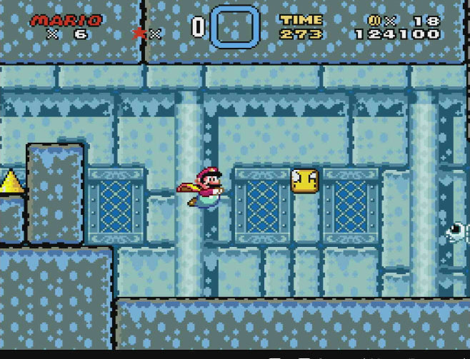 |
|バターブリッジ　コース1|道中の?ブロック|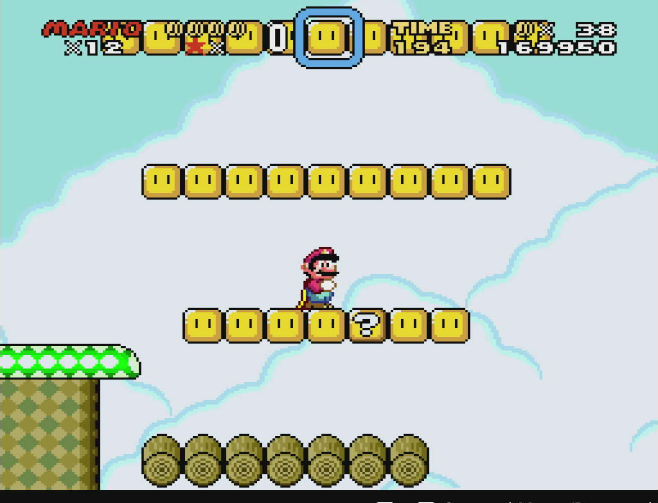 |
|バターブリッジ　コース2|マントガメ(マントが赤く点滅している個体のみ)|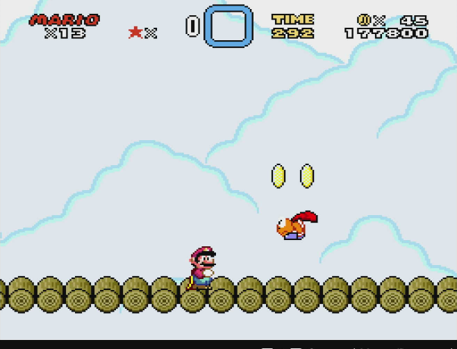 |
||道中の?ブロック|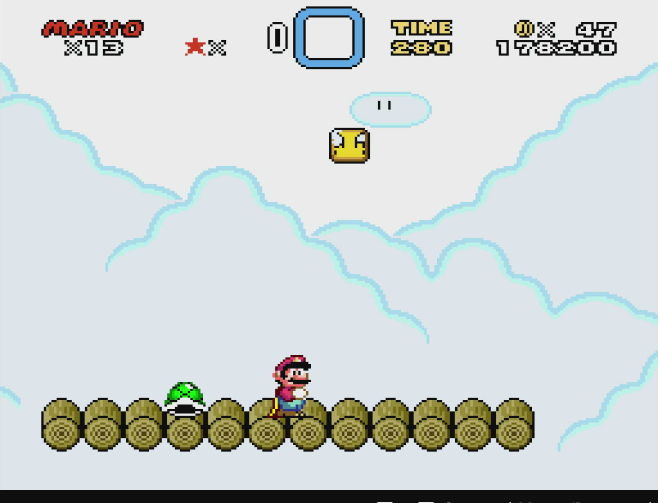 |
|せんべいやまのしろ|3部屋目右側の?ブロック|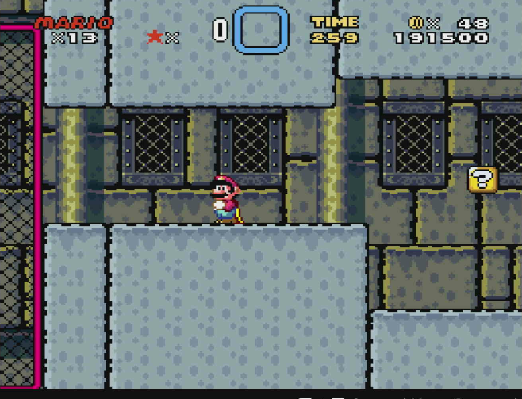 |
|まよいのもり　コース1|ルーレットブロック|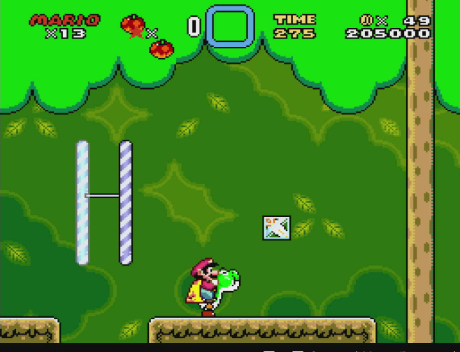 |
|チョコレーとうのオバケやしき|道中の?ブロック|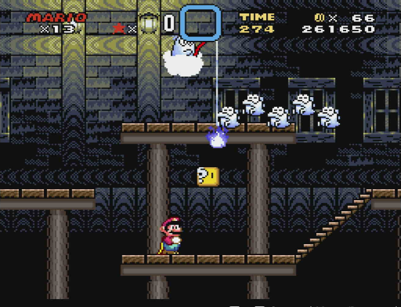 |
|チョコレーとう　コース2|2部屋目(1部屋目で21コイン取る必要あり)| |
|チョコレーとう　ひみつのコース1|1部屋目の?ブロック|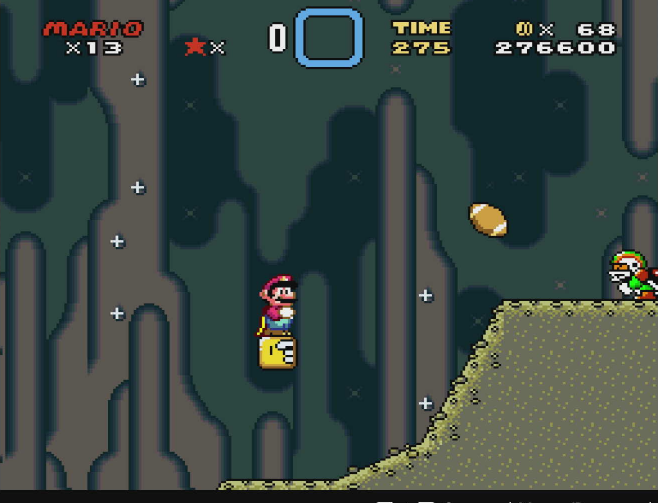 |
|ラムネかいこうのちんぼつせん|1部屋目の?ブロック|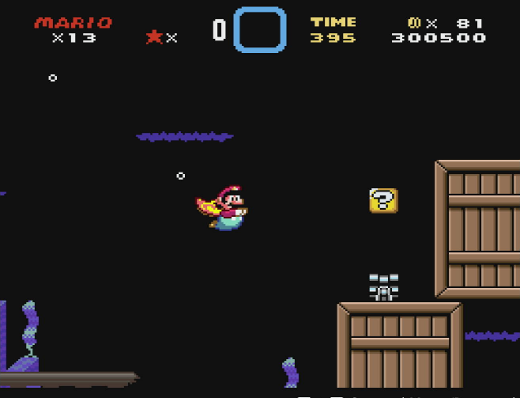 |
|まおうクッパのたに　コース2|1部屋目の?ブロック|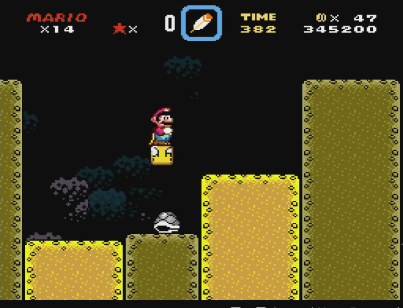 |
||2部屋目の?ブロック|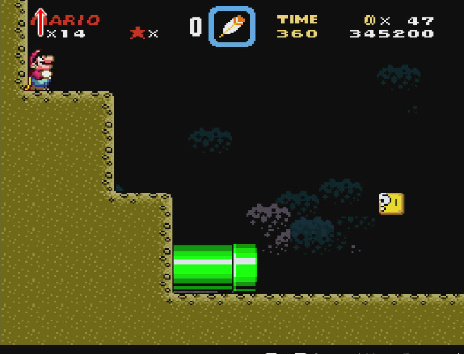 |

